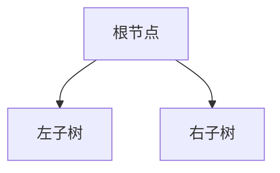

# 二叉树

二叉树可以定义未节点的有限集合，或者有一个成为根的节点和两个不相交的分别称作这个根的左子树和右子树的二叉树组成

## 二叉树的性质

在讲二叉树的性质之前，我们先对二叉树的基本概念和不同种的二叉树的定义进行理解

**节点的层数：**规定根的层数是0，其它的层数对标准二叉树图的层次形状·

**二叉树的高度：**最大层数称为二叉树的高度

**满二叉树(正则树)：**

* 如果只有度为0和2的节点且度为0的节点只在最后一层出现

* 只有在最后一层有叶节点，并且叶子节点

* 如果二叉树的任何内部节点出度均为2，即称为满二叉树

**完全二叉树：**如果一棵二叉树中，只有最下面的两层结点度数小于2，其余各层的结点度数都为2，则称为完全二叉树

**扩充二叉树：**扩充的二叉树是对一个已有的二叉树的拓展，扩充后的二叉树结点数目都为2

由上，我们可以理解以下的性质

* 在非空二叉树的i层上，至多有2^i个结点
* 高度为k的二叉树中，最多有2^(k+1)-1个结点
* 对于任何一个非空的二叉树，如果叶结点的个数为n，度数为2的结点的个数为m，则有n=m+1

* 扩充二叉树中，外部结点的数目是内部结点的数目多1
* 外部路径的长度E与外部路径I之间有关系：E = I + 2n 

## 二叉树的实现

**顺序实现**

如果用顺序实现二叉树，即是用一个数组保存一棵完全二叉树，无论这棵二叉树是怎样的，都要对其进行扩充，使之成为一棵完全二叉树

**链式实现**

线索二叉树

## 二叉树的周游

**深度优先周游**

前序：对一棵二叉树的遍历从根节点开始，以递归的角度，对每一层的节点进行根-左-右的顺序遍历

~~~

~~~

中序：对一棵二叉树的遍历从根节点开始，以递归的角度，对每一层的节点进行左-根-右的顺序遍历

后序：对一棵二叉树的遍历从根节点开始，以递归的角度，对每一层的节点进行左-右-根的顺序遍历

**广度优先周游**

# 树

同样的，树也具有一些性质

