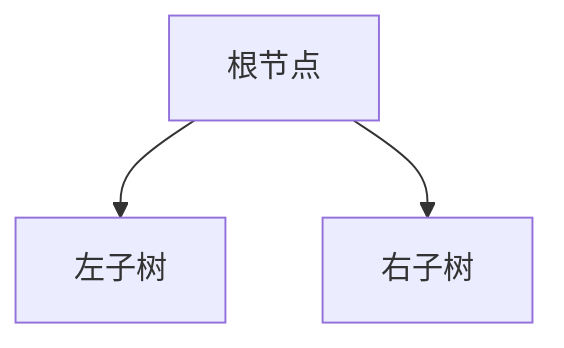

# 二叉树

二叉树可以定义未节点的有限集合，或者有一个成为根的节点和两个不相交的分别称作这个根的左子树和右子树的二叉树组成

## 二叉树的性质

在讲二叉树的性质之前，我们先对二叉树的基本概念和不同种的二叉树的定义进行理解

**节点的层数：**规定根的层数是0，其它的层数对标准二叉树图的层次形状·

**二叉树的高度：**最大层数称为二叉树的高度

**满二叉树(正则树)：**

* 任意一层的结点个数都达到了最大值
* 一棵高度为K的满二叉树具有2^k-1个结点

**完全二叉树：**对于深度为K有n个结点的完全二叉树，其每一个结点都与深度为K的满二叉树中编号为1~n的结点一一对应

* 叶子结点只可能在最大的两层出现
* 如果一个结点没有左孩子，那就也一定没有右孩子

**扩充二叉树：**扩充的二叉树是对一个已有的二叉树的拓展，扩充后的二叉树结点数目都为2

由上，我们可以理解以下的性质

* 在非空二叉树的i层上，至多有2^(i-1)个结点
* 高度为k的二叉树中，最多有2^(k+1)-1个结点
* 对于任何一个非空的二叉树，如果叶结点的个数为n，度数为2的结点的个数为m，则有n=m+1
* 具有n个结点的完全二叉树的高度K=[log(n+1)]
* 扩充二叉树中，外部结点的数目是内部结点的数目多1
* 外部路径的长度E与外部路径I之间有关系：E = I + 2n 

## 二叉树的实现

**顺序实现**

如果用顺序实现二叉树，即是用一个数组保存一棵完全二叉树，无论这棵二叉树是怎样的，都要对其进行扩充，使之成为一棵完全二叉树，因为顺序实现的二叉树实在是效率太低，这里不记录实现代码，只讲基本原理。

**链式实现**：

~~~c
typedef char DataType;

//二叉树结点定义
typedef struct node {
    DataType data; //存放结点数据
    struct node *lchild, *rchild; //左右孩子指针
} BiTree;

typedef struct node *ptree;

void print(DataType d) {
    cout << d << " ";
}

BiTree *createBiTree() {
//请在此处填写代码，完成创建二叉树并返回二叉树根结点指针的功能
    ptree new_tree = (ptree) malloc(sizeof(BiTree));
    scanf("%c", &new_tree->data);
    if (new_tree->data == '#') return NULL;
    new_tree->lchild = createBiTree();
    new_tree->rchild = createBiTree();
    return new_tree;
}
~~~

二叉树大多是链式定义的，这样更加节省空间，方便使用递归遍历。相对的，在物理结构上更难定义。

## 二叉树的周游

**深度优先周游**

前序：对一棵二叉树的遍历从根节点开始，以递归的角度，对每一层的节点进行根-左-右的顺序遍历

~~~c
void preOrder(BiTree *T) {
//请在此处填写代码，完成先根遍历二叉树功能
    if (T == NULL) { return; }
    print(T->data);
    preOrder(T->lchild);
    preOrder(T->rchild);
}
~~~

中序：对一棵二叉树的遍历从根节点开始，以递归的角度，对每一层的节点进行左-根-右的顺序遍历

~~~c
void inOrder(BiTree *T) {
    //请在此处填写代码，完成中根遍历二叉树功能
    if (T == NULL) { return; }
    inOrder(T->lchild);
    print(T->data);
    inOrder(T->rchild);
}
~~~

后序：对一棵二叉树的遍历从根节点开始，以递归的角度，对每一层的节点进行左-右-根的顺序遍历

~~~c
void postOrder(BiTree *T) {
    //请在此处填写代码，完成后根遍历二叉树功能
    if (T == NULL) { return; }
    postOrder(T->lchild);
    postOrder(T->rchild);
    print(T->data);
}
~~~

**广度优先周游**

~~~c

~~~

## 二叉树的应用

**哈夫曼编码**：利用优先队列实现哈夫曼编码（看不懂）

注意哈夫曼树遵循左边结点值小，右边结点值次小的定义

~~~c++
/*请在此处编写代码，完成哈夫曼编码，并按中序遍历顺序输出每个叶子结点的编码*/
#include <bits/stdc++.h>

using namespace std;

typedef int DataType;

//二叉树数据结构
struct node {
    DataType info; //存放结点数据
    struct node *parent, *lchild, *rchild; //定义指向左右孩子和父节点的指针
    node(DataType in, struct node *pa, struct node *lc, struct node *rc) : info(in), parent(pa), lchild(lc), rchild(rc) {}

    bool operator<(const node &c) const {//info小的放在队头
        return info > c.info;
    }
};

typedef struct node *BiTree;

//编码函数
void Code(BiTree T) {
    if (T->parent == NULL) return;
    else if (T->parent->lchild == T) {
        Code(T->parent);
        printf("0");

    } else if (T->parent->rchild == T) {
        Code(T->parent);
        printf("1");
    }
}

void inOrder(BiTree T) {
    //完成中根遍历二叉树功能
    if (T == NULL) return;
    inOrder(T->lchild);
    if (T->lchild == NULL && T->rchild == NULL) {
        printf("%d ", T->info);
        Code(T);
        printf("\n");
    }
    inOrder(T->rchild);
}

BiTree createNode(int in, struct node *pa, struct node *lc, struct node *rc) {
    //完成结点创建，返回值是二叉树的根结点指针
    BiTree T;
    T = (struct node *) malloc(sizeof(struct node));
    T->info = in;
    T->parent = pa;
    T->lchild = lc;
    T->rchild = rc;
    if (lc != NULL) {
        lc->parent = T;
    }
    if (rc != NULL) {
        rc->parent = T;
    }
    return T;
}

int main() {
    int n;
    cin >> n;
    priority_queue<node> pq;//优先队列里面存放结点，按照权重大小排序

    int num;
    for (int i = 0; i < n; i++) {
        cin >> num;
        pq.push(node(num, NULL, NULL, NULL));//让T进入队列
    }

    BiTree a, b, par;
    while (pq.size() != 1) {
        //从优先队列里出来俩个结点
        a = createNode(pq.top().info, pq.top().parent, pq.top().lchild, pq.top().rchild);
        pq.pop();
        b = createNode(pq.top().info, pq.top().parent, pq.top().lchild, pq.top().rchild);
        pq.pop();

        par = createNode(a->info + b->info, NULL, a, b);
        a->parent = par;
        b->parent = par;
        pq.push(*par);//让生成的父节点进入优先队列

    }
    //找到根节点
    node root = pq.top();
    inOrder(&root);
}
~~~

# 树和森林

同样的，树也具有一些性质

* 树是二叉树的具体化，

## 树的存储形式

**双亲孩子链表法**

**长子兄弟法**

**树、森林和二叉树之间的转换**

  
